# Introducción y Aplicación de Sass

En nuestra segunda práctica se han trabajado la modularización del código Sass mediante parciales y la aplicación de Flexbox y CSS Grid para construir el layout de una landing page.

## Uso de Flexbox

Flexbox es un modelo de layout unidimensional, es decir, organiza los elementos en una sola dirección: o en fila o en columna. Resulta especialmente útil cuando es el propio contenido el que dicta el tamaño de los elementos y solo necesitamos distribuirlos, alinearlos o repartir el espacio sobrante entre ellos.

En nuestro caso, hemos utilizado Flexbox en varias secciones del proyecto. En el header, el contenedor principal hace uso de `display: inline-flex` junto con `justify-content: space-between` y `align-items: center` para colocar el logo a un lado y el título al otro, manteniéndolos centrados verticalmente. Se trata de una fila simple con dos ítems, por lo que Flexbox es la opción natural.

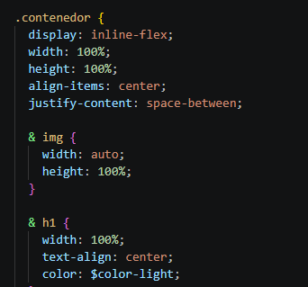

En la sección de productos, el contenedor `.productos` utiliza `display: flex` con `justify-content: space-around` y `flex-wrap: wrap`. Esto permite que las tarjetas de producto se repartan horizontalmente y salten a la siguiente línea cuando no caben, adaptándose así a distintos tamaños de pantalla sin necesidad de definir columnas explícitas.

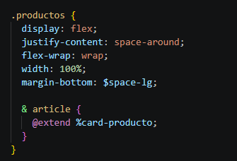

El mismo patrón se repite en las secciones de clientes y garantías, donde los testimonios y las tarjetas de garantía son ítems equivalentes que deben distribuirse en fila y adaptarse al ancho disponible. En ambos casos se ha usado `flex-wrap: wrap` para permitir que los elementos se reorganicen cuando el espacio se reduce.

Por último, en la sección de redes sociales del footer hemos utilizado Flexbox con `justify-content: center` y `gap` para centrar horizontalmente los iconos y separarlos con una distancia uniforme. Al ser una fila corta y fija, Flexbox resuelve el problema con muy pocas líneas.

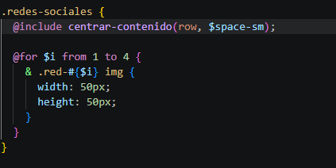

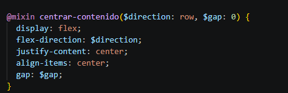

## Uso de CSS Grid

Grid es un modelo de layout bidimensional, es decir, organiza los elementos en filas y columnas simultáneamente. Resulta ideal cuando es el layout quien dicta el tamaño de los elementos, y no al contrario.

En nuestro proyecto, hemos utilizado Grid principalmente en el formulario. El contenedor `.formulario` utiliza `display: grid` con `grid-template-columns: 1fr 1fr`, lo que divide la sección en dos columnas iguales: a la izquierda el formulario de comentarios y a la derecha la imagen decorativa del fantasma. Esta estructura es claramente bidimensional, ya que necesitamos dos zonas diferenciadas que convivan en la misma fila, y por eso Grid es la elección correcta frente a Flexbox.

También hemos usado Grid dentro del formulario, en el contenedor `.contenedor-inputs`. En este caso, se ha definido `grid-template-columns: 1fr` junto con `place-items: center` para apilar los campos del formulario en una sola columna y centrarlos perfectamente en ambos ejes. Aunque solo haya una columna, usar Grid permite centrar cada ítem horizontal y verticalmente con una sola declaración, algo que con Flexbox requeriría combinar `justify-content` y `align-items` por separado.

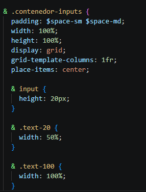

## Características de Sass

El proyecto está dividido en parciales, es decir, archivos que comienzan por guion bajo y que no se transpiilan por sí solos, sino que se importan desde un fichero principal. Cada parcial agrupa una responsabilidad concreta y aplica una o varias características de Sass.

En el parcial `_variables.scss` hemos definido las variables globales del proyecto, como los colores, los tamaños, los radios, la tipografía y los espaciados. Las variables nos permiten almacenar valores que se repiten en varios parciales y modificarlos desde un único punto. Si mañana cambia el color corporativo o el tamaño de la cabecera, basta con modificar una sola línea para que el cambio se propague a todo el sitio.

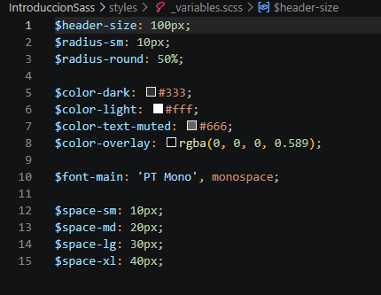

En el parcial `_mixins.scss` hemos definido los mixins reutilizables. Hemos creado un mixin para encabezados, que recibe como parámetro el tamaño de fuente y aplica negrita y centrado; un mixin específico para los h2, que reutiliza internamente el mixin de encabezados y le añade un margen inferior; un mixin para centrar contenido, que recibe la dirección del contenedor flex y el espacio entre ítems; y un mixin para los estilos del formulario, que agrupa las propiedades comunes del formulario como el fondo, el radio, el color del texto y el centrado. Los mixins con parámetros nos permiten reutilizar bloques de estilos con variaciones, evitando repetir código.

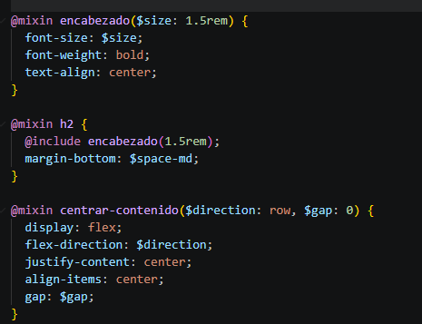

En el parcial `_base.scss` hemos agrupado los estilos comunes a todo el sitio. Aquí se encuentra el reset universal, la tipografía base del cuerpo y los estilos de los encabezados, que aplican los mixins definidos en el parcial anterior mediante `@include`. También hemos añadido una utilidad de centrado que reutiliza el mixin correspondiente. Todo lo que aplica a cualquier página del sitio vive en este parcial.

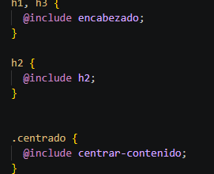

En el parcial `_formulario.scss` hemos hecho un uso intensivo del anidamiento y hemos aplicado el mixin de estilos del formulario mediante `@include`. Además, hemos anidado la pseudo-clase `:focus` dentro de los selectores de `input` y `textarea`, de modo que los estilos de foco quedan junto a los estilos base del campo. Cuando el usuario hace clic sobre un campo, este se resalta con un borde blanco y un halo luminoso, mejorando la accesibilidad y la experiencia de usuario. Esto es exactamente lo que pedía el ejercicio.

En el parcial `_productos.scss` hemos definido un placeholder selector, es decir, un selector que comienza por porcentaje y que solo existe para ser extendido. Este placeholder contiene el estilo base de las tarjetas y no genera CSS por sí mismo. Después lo hemos aplicado a los artículos de producto mediante `@extend`. Usar un placeholder y no un selector anidado es importante porque Sass no permite extender selectores anidados desde otro archivo.

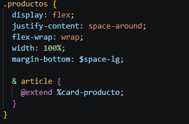

En el parcial `_clientes.scss` hemos aplicado la herencia real que pedía el ejercicio. Los bloques de cliente extienden el mismo placeholder definido en productos mediante `@extend`, de modo que heredan todas las propiedades de las tarjetas de producto sin duplicar código fuente. Si en el futuro se modifica el estilo base de las tarjetas, tanto productos como clientes se actualizan automáticamente.

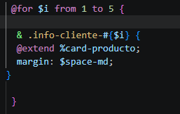

En el parcial `_garantias.scss` hemos utilizado un bucle `@for` junto con interpolación de variables para generar las cuatro clases de garantía sin repetir el mismo bloque cuatro veces. La interpolación permite incrustar el valor del índice dentro del nombre del selector, generando clases como `.garantia-1`, `.garantia-2`, etc. Además, cada tarjeta de garantía extiende el placeholder de productos, reutilizando así el estilo base.

En el parcial `_footer.scss` hemos reutilizado el mixin de centrado para alinear los iconos de redes sociales y hemos usado otro bucle `@for` para generar las clases de los iconos sin repetir código.

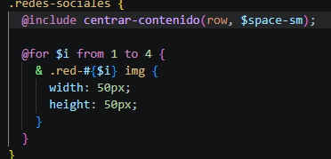

Por último, en el fichero principal `styles.scss` hemos importado todos los parciales en un orden concreto. El orden importa porque las variables y los mixins deben ir primero para que el resto pueda usarlos, y porque productos debe ir antes que clientes, ya que clientes extiende el placeholder definido en productos. Hemos usado `@import` en lugar de `@use` porque `@extend` necesita que los selectores estén en el mismo scope global para poder extenderlos entre archivos.

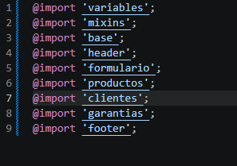

## Resultado

A continuación se muestra una breve imagen del resultado de la página web:

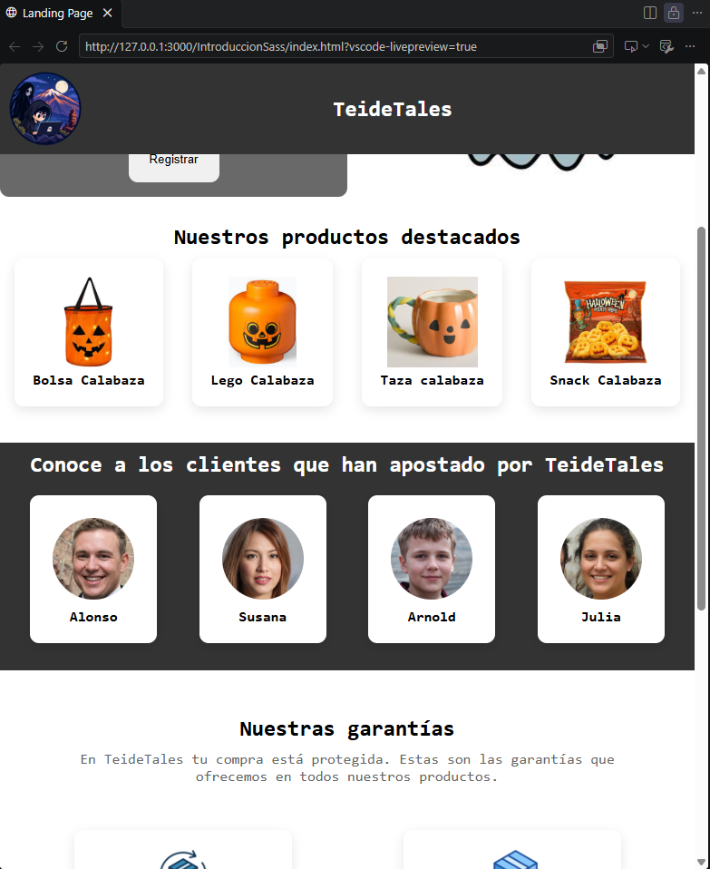