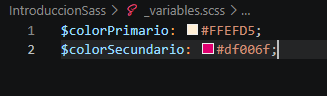
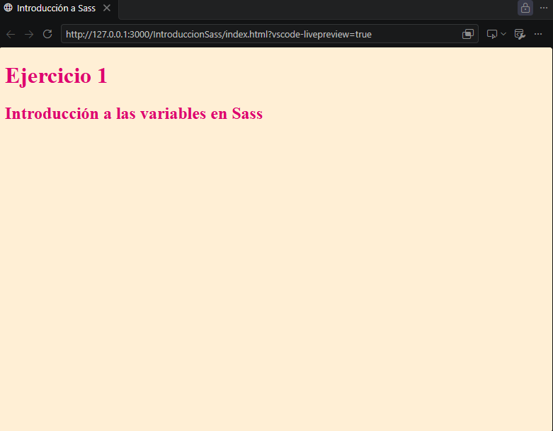

# Introducción y Aplicación de Sass
Este repositorio constituye la primera práctica de la asignatura Sistemas y Tecnología Web: Cliente.

## Sintaxis de Sass

Sass consiste en dos sintaxis, la original que usa la indentación para separar bloques de código y el carácter de salto de línea para separar las reglas, mientras que la nueva sintáxis permite separar entre corchetes bloques de código y el carácter punto y coma para separar las reglas entre sí.

## Instalación de Sass

Para instalar Sass poseemos dos maneras, mediantes aplicativos o línea de comando. En nuestro caso lo instalaremos con el último método. Debemos tenemos un gestor de paquete que puede varíar según el sistema operativos sobre el que operemos:

* NPM: Gestor de paquete para Javascript
* Chocolatey (Windows)
* Homebrew (MacOS o Distribuciones Linux)

Para instalar con el gestor npm o gema de Ruby, podemos utilizar el siguiente comando:
```bash
npm install -g sass
```

```bash
gem install sass
```

En caso de quisieramos instalarlo con una aplicación, podemos utilizar Scout-App, aplicación Open Source que nos permite instalar sass en cualquier sistema operativo actual, ya sea Linux, Windows, Mac...
Podemos acceder al aplicativo mediante el siguiente enlace:
[Scout-App](https://scout-app.io/)

## Ejercicio 1

**Crea un parcial de definición de de las variables para el color primario y secundario y utilizarlo para definir estilos para el body y los títulos h1 h2 Verifica que las variables se hayan aplicado correctamente.**

### Variables 

Espacios que nos permiten almacenar valores para ser utilizados posteriormente.
La sintaxis de las variables en Sass se estructura de la siguiente forma:
```sass
$variable: valor;
```

Hemos definido los valores de los colores primario y secundario y se han almacenado en dos variables con un nombre identificativo dentro del fichero _variables.scss:


### Parciales

Estos son archivos individuales que contienen fragmentos de código CSS o Sass y su propósito es importarse en ficheros principales.

En nuestro caso, importaremos el fichero de las variables en el fichero principal denominado styles.scss donde se han utilizado las variables para dar el color primario al cuerpo del documento (body) y color secundario a las cabeceras que se encuentran en este:


Finalmente es necesario transpilar el código Sass en uno equivalente en hojas de estilo CSS. Para ello, tras haber instalado el compilador, ejecutamos el siguiente comando:

```bash
sass styles.scss:styles.css
```

### Resultado
Una vez finalizada la compilación, el resultado obtenido es el siguiente:

