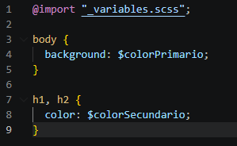
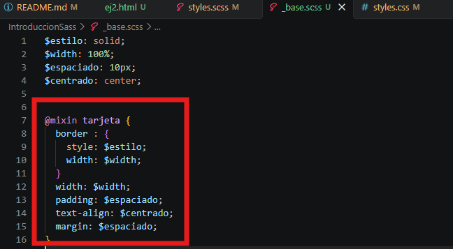
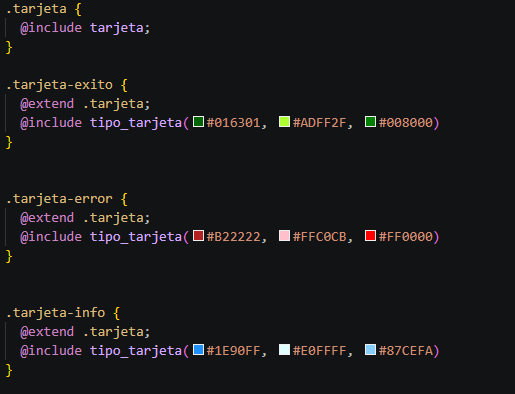
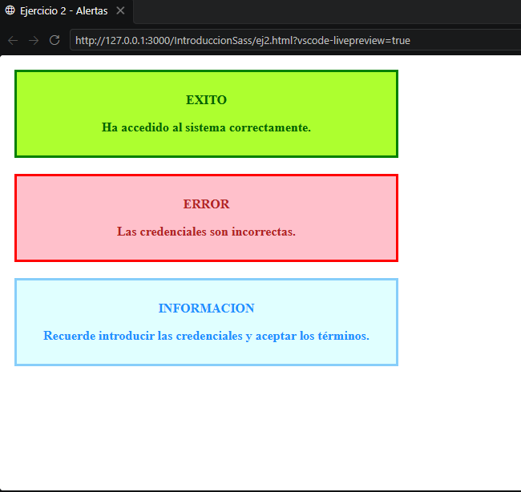
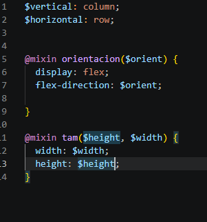
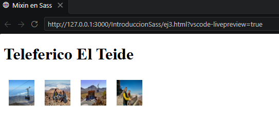
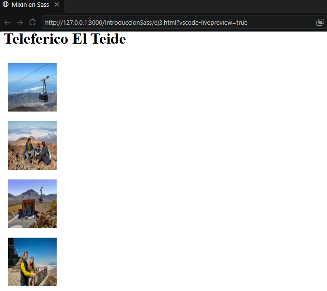

# Introducción y Aplicación de Sass
Este repositorio constituye la primera práctica de la asignatura Sistemas y Tecnología Web: Cliente.

## ¿Qué es Sass?

Es un preprocesador de CSS que extiende las capacidades del CSS tradicional. Funciona como una capa intermedia: escribes el código con funciones avanzadas y luego se compila a un archivo CSS estándar que los navegadores pueden interpretar

## Sintaxis de Sass

Sass consiste en dos sintaxis, la original que usa la indentación para separar bloques de código y el carácter de salto de línea para separar las reglas, mientras que la nueva sintáxis permite separar entre corchetes bloques de código y el carácter punto y coma para separar las reglas entre sí.

## Instalación de Sass

Para instalar Sass poseemos dos maneras, mediantes aplicativos o línea de comando. En nuestro caso lo instalaremos con el último método. Debemos tenemos un gestor de paquete que puede varíar según el sistema operativos sobre el que operemos:

* NPM: Gestor de paquete para Javascript
* Chocolatey (Windows)
* Homebrew (MacOS o Distribuciones Linux)

Para instalar con el gestor npm o gema de Ruby, podemos utilizar el siguiente comando:
```bash
npm install -g sass
```

```bash
gem install sass
```

En caso de quisieramos instalarlo con una aplicación, podemos utilizar Scout-App, aplicación Open Source que nos permite instalar sass en cualquier sistema operativo actual, ya sea Linux, Windows, Mac...
Podemos acceder al aplicativo mediante el siguiente enlace:
[Scout-App](https://scout-app.io/)

## Ejercicio 2

**Crea un parcial de definición de de las variables para el color primario y secundario y utilizarlo para definir estilos para el body y los títulos h1 h2 Verifica que las variables se hayan aplicado correctamente.**

### Variables 

Espacios que nos permiten almacenar valores para ser utilizados posteriormente.
La sintaxis de las variables en Sass se estructura de la siguiente forma:
```sass
$variable: valor;
```

Hemos definido los valores de los colores primario y secundario y se han almacenado en dos variables con un nombre identificativo dentro del fichero _variables.scss:


### Parciales

Estos son archivos individuales que contienen fragmentos de código CSS o Sass y su propósito es importarse en ficheros principales.

En nuestro caso, importaremos el fichero de las variables en el fichero principal denominado styles.scss donde se han utilizado las variables para dar el color primario al cuerpo del documento (body) y color secundario a las cabeceras que se encuentran en este:



Finalmente es necesario transpilar el código Sass en uno equivalente en hojas de estilo CSS. Para ello, tras haber instalado el compilador, ejecutamos el siguiente comando:

```bash
sass styles.scss:styles.css
```

### Resultado
Una vez finalizada la compilación, el resultado obtenido es el siguiente:


## Ejercicio 3

**Construye una hoja de estilos Sass para un sistema de mensajes de estado (como alertas de éxito, error o información) que sea modular, DRY (Don't Repeat Yourself) y fácil de mantener. Crea el estilo base en un parcial que no se compile por sí sólo, úsalos para definir estilos específicos para mensajes informativos, de error y de éxito. El color del fondo debe ser acorde con lo que representan. Además los enlaces dentro del mensaje de error deben estar en negrita. Comprueba que se transpila correctamente.**

### Anidamiento

En primer, en el parcial _base.scss hemos creado la estructura inicial de una tarjeta. En este se ha incluido un anidamiento para permitir definir la estructura de las tarjetas en base a los selectores que derivan de border.



Además, hemos utilizado la variables para definir valores que puedan modificarse fácilmente en futuras ocasiones de manera sencilla. Esto nos permite tener un control íntegro de las características de los componentes y selectores a medida que se van incorporando en el proyecto.

Por ejemplo, hemos utilizado la variable espaciado para definir el padding y márgenes de las tarjetas (tanto interna como externamente).

### Herencia

Otra característica que recoge Sass es la capacidad de extender las características a otros elementos. En nuestro caso, hemos utilizado como elemento padre .tarjeta. Este posee las propiedades definidas en un mixin de la hoja sass base.

Una vez tenemos las características principales, aplicamos la herencia con la instrucción extend para crear tarjetas que, aunque tengan las mismas propiedades de una tarjeta base, poseen estilos diferentes. Un ejemplo de esto último sería la paleta de colores utilizada. Esto se debe a que representa un tipo de señalización diferente (error, éxito e información).



### Mixin

Los mixins permiten definir estilos que pueden reutilizarse en diferentes partes de una hoja de estilos. Además, pueden recibir parámetros, como hemos hecho en cada una de las tarjetas para definir sus colores, o no recibirlos, como ocurre al tomar las características definidas en una tarjeta base.

### Resultado
Una vez finalizada la compilación, el resultado obtenido es el siguiente:



## Ejercicio 4

**Crea dos mixins, uno que permita establecer la dirección de un contenedor flexbox y el otro que permita dar un tamaño específico en un elemento. Verifica que transpila y funciona correctamente sobre algún ejemplo.**


Al igual que en el ejercicio anterior, en este ejercicio hemos trabajado con los mixins de Sass. En este caso, hemos creado dos mixin: uno para establecer la orientación de un contenedor Flexbox, recibiendo como parámetro la dirección (`row` o `column`), y otro para establecer el tamaño de un elemento, recibiendo como parámetros su altura y anchura.

Para facilitar su uso, hemos definido las variables `$vertical` y `$horizontal`, que permiten indicar de forma sencilla la orientación del contenedor.



### Resultado
Una vez finalizada la compilación, el resultado obtenido es el siguiente:



